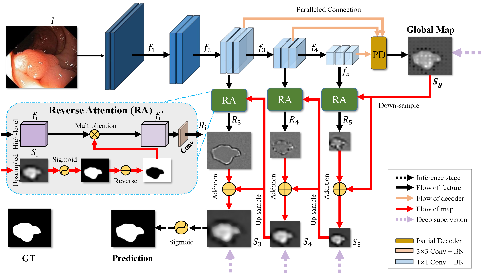

## My Image Segmentation
### Including

Unet

R2Unet

AttentionUnet

R2AttenUnet

Unet++

PraNet

PraNet++

## CVC ClinicDB

U2PraNet++有SA(mask out):
Dice 0.912(0.927)

PraNet:
Dice 0.896

U2PraNet++无SA:
Dice 0.913

U2PraNet++(SE,ASPP):
Dice 0.894

U2PraNet++(init):
Dice 0.894

PraNet++:
Dice 0.889

PraNet(bs=2):
Dice = 0.845

## Kvasir

U2PraNet++:
Dice = 0.879

PraNet:
Dice = 0.858

## CVC-300

U2PraNet++:
Dice = 0.866

PraNet:
Dice = 0.789

## CVC-ColonDB

U2PraNet++:
Dice = 0.741

PraNet:
Dice = 0.699

## ETIS-LaribPolypDB

U2PraNet++:
Dice = 0.606

PraNet:
Dice = 0.458
